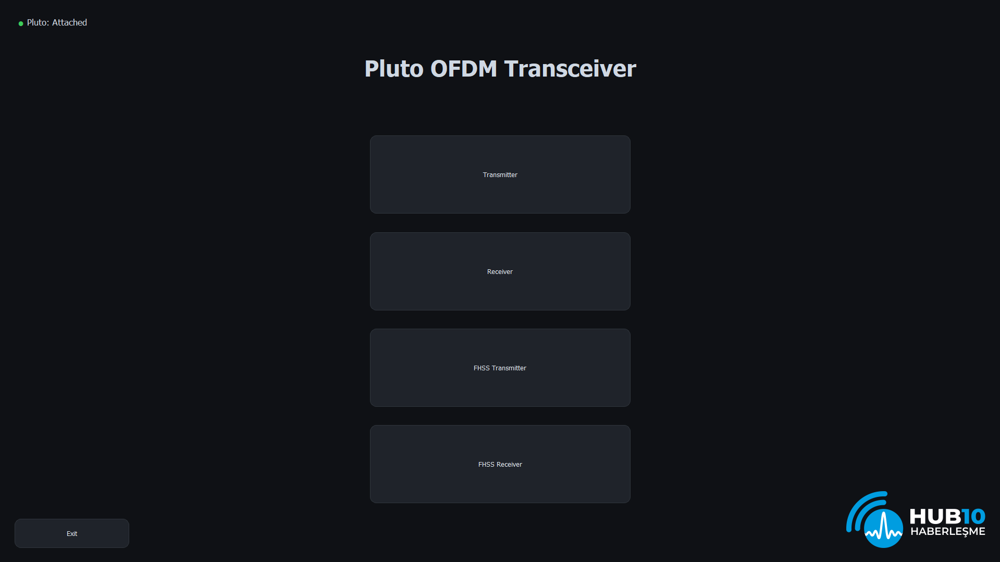
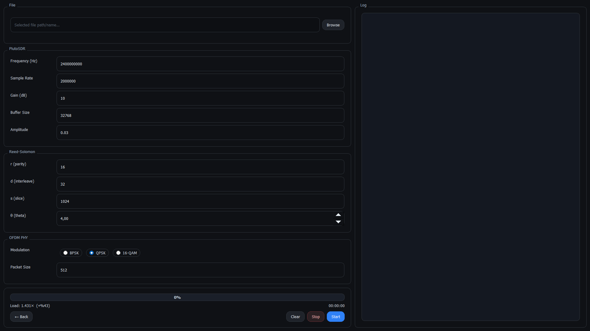
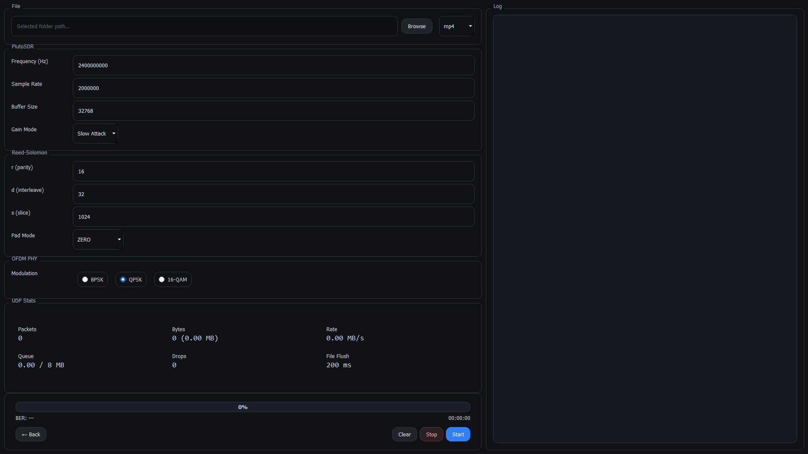
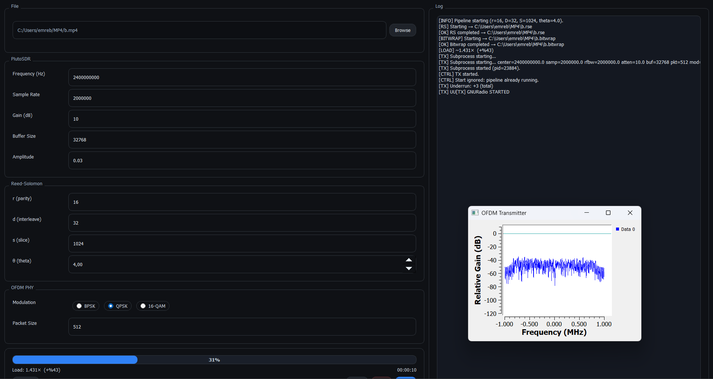

# PlutoOFDMTransceiver  

## About the Project  
PlutoOFDMTransceiver is a OFDM communication system based on **ADALM-Pluto SDR**.  
- **Tx/Rx chains**  
- **OFDM + BPSK/QPSK/16-QAM modulation**  
- **Reed-Solomon error correction + Bitwrap processing**  
- **FHSS-based jammer resistance**  
- **PyQt5-based user interface**  
- **Portable Radioconda environment for Windows**  

This project was developed for competition.  

---

## Project Structure  
```
PlutoOFDMTransceiver/
├── controllers/       # Application controllers (Tx, Rx, FHSS etc.)
├── doc/               # Documents
├── native/            # C/C++ based DLL/EXE sources
├── scripts/           # Pluto runner, jammer detection scripts
├── services/          # RS, Bitwrap services
├── ui/                # PyQt5 GUI files
├── main.py            # Main entry point
├── paths.py           # Path manager for portable environment
├── run.bat            # Script to launch the application
├── run_bootstrap.bat  # Portable Python setup bootstrap
└── pyproject.toml     # Python dependencies
```

---

## Features  
- **SDR-based OFDM communication**  
- **Jammer detection** (Energy + GMM)  
- **FHSS frequency hopping**  
- **Reed-Solomon + CRC error correction**  
- **Bitwrap** dummy data insertion/removal  
- **PyQt5 GUI** for easy use  
- **Portable Windows deployment** (Radioconda)  

---

## Screenshots

### Main Interface  



### Transmitter Mode  



### Active Transmission  



### Receiver Mode  



## Installation  

### Requirements  
- Windows 10/11  
- ADALM-Pluto SDR (USB 2.0 connection)
- ADALM-Pluto SDR **Driver** (official Analog Devices driver)  
- Python (portable Radioconda environment installed via `run_bootstrap.bat`)  

### Steps  
1. Clone the repository:  
   ```bash
   git clone https://github.com/<user>/PlutoOFDMTransceiver.git
   cd PlutoOFDMTransceiver
   ```
2. Set up the portable Python environment:  
   ```bash
   run_bootstrap.bat
   ```
3. Run the application:  
   ```bash
   run.bat
   ```

---

## Usage  
- **Tx Mode**: File-based data transmission  
- **Rx Mode**: Receiver with RS/Bitwrap decoding  
- **FHSS Mode**: Frequency hopping under jammer conditions  
- **GUI**: Parameters for modulation, bandwidth, power, file selection  

---
> **Important Note:**  
> The FHSS system implemented in this project was specifically designed for the competition environment.  
> Reproducing the same functionality may not be feasible unless the exact hardware, conditions, and configurations are replicated.

## Test Results  
- 1m lab test and 15m open-field test  
- Comparison between 2 MHz and 3 MHz bandwidths  
- QPSK vs 16-QAM BER analysis  
- FHSS response time under jammer conditions  

---

## Future Work  
- FPGA acceleration  
- MIMO antenna support  
- More advanced GUI and KPI dashboards  

---

## License  
This project is licensed under **GPL-3.0**.  
